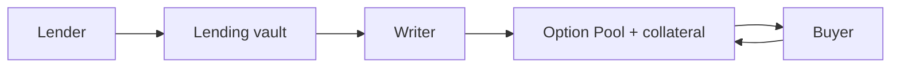
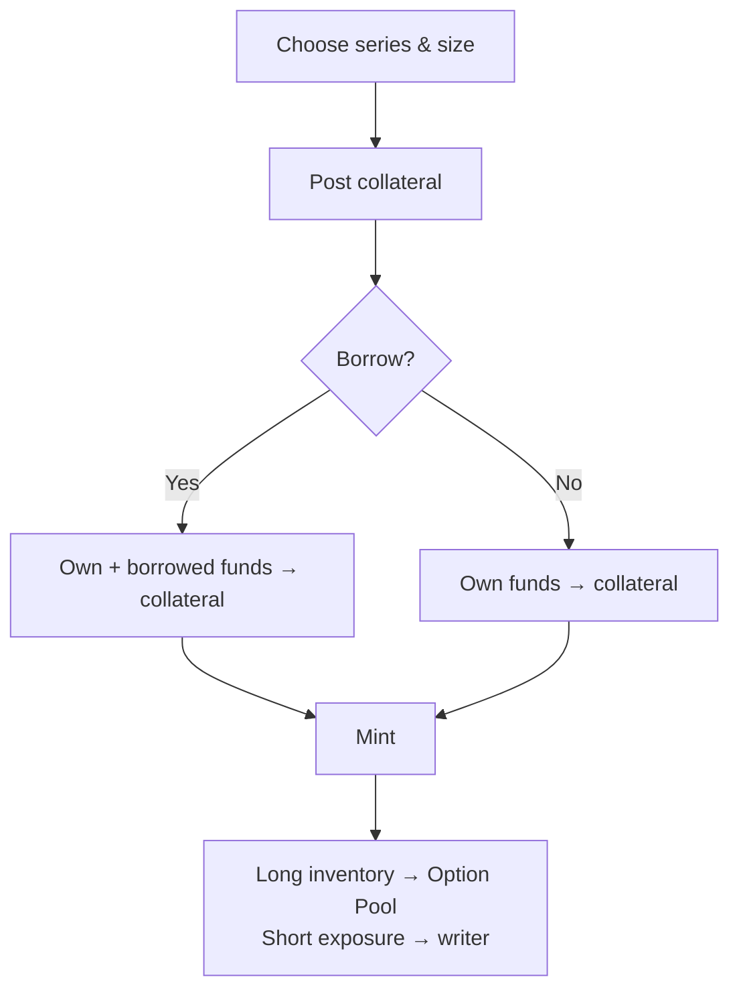
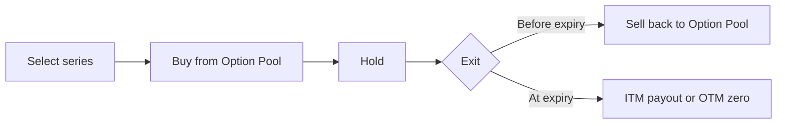
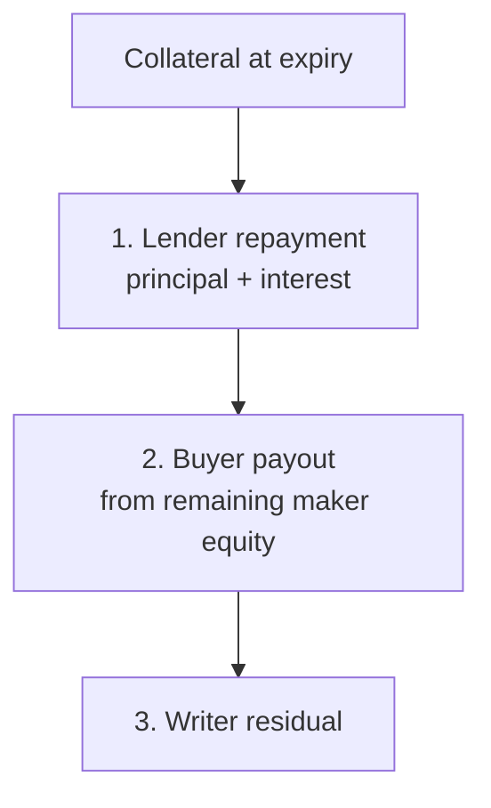
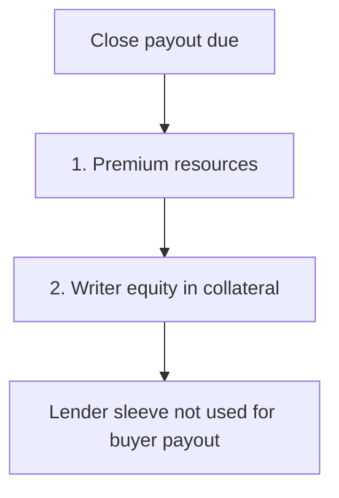

# How Epicentral Works

> A public overview of Epicentral’s on-chain options protocol for market makers, liquidity providers, and partners.

---

## Summary

Epicentral is built around **Option Pools**: shared, on-chain liquidity for each option series. Writers supply collateralized inventory, buyers trade against that pool in a single transaction, and lenders can optionally fund writer capacity through a lending vault. Pricing is **Black–Scholes** with **utilization-aware implied volatility**. At expiry, settlement clears lenders first, then buyers from remaining maker equity, then writers.

Unlike a classic order book, writers do not post resting asks. They mint into an Option Pool; buyers consume that inventory at the protocol’s executable premium.

---

## The three roles

| Role       | What they do                                                   | How they earn / benefit      | Main risk                                   |
| ---------- | -------------------------------------------------------------- | ---------------------------- | ------------------------------------------- |
| **Writer** | Mints options into an Option Pool, posts collateral (± borrow) | Premium + time-value capture | Adverse spot moves; leverage amplifies loss |
| **Buyer**  | Buys long exposure from the Option Pool                        | Asymmetric upside vs strike  | Typically limited to premium paid           |
| **Lender** | Deposits into a vault writers may borrow from                  | Borrow interest              | Borrower health / shortfall under stress    |

Desks evaluating the protocol usually care most about **writing** and **lending**. Directional traders enter as **buyers**.

---

## Building blocks

**Option series** — underlying + call/put + strike + expiry. Writers mint into a series; buyers trade that series.

**Option Pool** — the buyer-facing liquidity for a series. Writers deposit long inventory when they mint; buyers purchase from it; early closes return inventory to the pool (recycled), restoring supply.

**Collateral pool** — funds backing payouts for that series (writer equity, plus any borrowed vault capital).

**Lending vault** — lets writers scale inventory without posting 100% collateral themselves. Borrowed funds are escrowed into collateral, accrue interest, and repay with seniority over the writer’s residual claim.

---

## Writer flow: creating liquidity

1. Choose series parameters and size
2. Post collateral in a supported settlement asset
3. Optionally borrow from the matching vault (leverage and maintenance limits apply)
4. Mint: **long inventory** into the Option Pool, **short exposure** to the writer

Providing liquidity here means supplying **option inventory + collateralized risk capacity** — not quoting two tokens like a spot AMM. Depth improves as more writers mint into the same series.

Without leverage, writers post full required collateral. With vault borrowing, the same size needs less equity — and carries more liquidation risk.

---

## Buyer flow: trading

**Open** — Select series and size. The protocol quotes premium from oracle spot + Black–Scholes + utilization-based IV. If inventory and risk checks pass, the buy fills in one transaction.

**Close early** — Sell back to the Option Pool at a model price. Returned longs become available inventory again.

**Hold to expiry** — OTM: typically no buyer payout (writers keep premium, net of other obligations). ITM: buyers are entitled to intrinsic value, paid from remaining **maker equity** after lenders are repaid — and **pro-rata capped** if aggregate intrinsic owed exceeds that pot. Entitlements are prepared at expiry; buyers claim them to receive funds.

---

## Pricing

### Black–Scholes

| Input                | Meaning                                  |
| -------------------- | ---------------------------------------- |
| Spot                 | Verified oracle price at trade time      |
| Strike / time / rate | Series parameters + protocol market data |
| Volatility           | Utilization-aware implied vol (below)    |

On-chain execution is the source of truth; UI estimates mirror the same conventions. Greeks are available for risk and display.

### Utilization-aware IV (“kink” model)

Implied volatility is a **deterministic function of Option Pool utilization**, anchored to baseline historical volatility — not a discretionary dealer surface.

**Utilization ≈** buyer-held open interest ÷ deposited inventory capacity.

- **Below ~50% utilization:** IV rises gently above baseline  
- **Above ~50% utilization:** IV rises more steeply

Higher utilization → scarcer remaining inventory → higher IV → higher premiums.

| Traditional venues                     | Epicentral                                 |
| -------------------------------------- | ------------------------------------------ |
| IV from quotes, smiles, or desk models | IV from on-chain utilization + baseline HV |
| Stress shows up as wider spreads       | Stress is priced directly into volatility  |
| Often opaque                           | Transparent and reproducible every trade   |

**Marginal pricing:** buys use utilization *after* the trade; closes use utilization *after* removing that size. Same-block buy-then-sell is not a free arb against the pool formula. Large buys can pay a higher effective IV than the displayed 1-lot mark.

---

## How Option Pools match flow

1. Writer mints → inventory sits in the Option Pool
2. Buyer buys → inventory is consumed
3. Sold contracts are attributed to writers **FIFO** (earlier writers first; ties broken consistently)

FIFO gives early writers predictable priority and removes fill-order games.

**Self-fill is skipped.** If a buyer would match their own writer inventory in that Option Pool, that portion is not filled, charges no premium, and does not inflate open interest. Only non-self inventory opens a long.

On early close, longs return to the pool and sold exposure is redistributed **pro-rata** across writers by how much each still has sold. Writers do not manually re-list recycled inventory.

---

## Writer economics

**Premium** from buyers is the primary revenue for the short side.

**Unsold vs sold**

- **Unsold** — still in the Option Pool; typically unwindable (subject to debt/health) to reclaim collateral  
- **Sold** — buyer-held; writer carries short risk until close or expiry

**Two meanings of “theta”**

1. **Model θ (Greek)** — expected daily premium decay; useful for risk dashboards
2. **Protocol theta** — on-chain accounting that attributes time-value to writers for equity, unwind, and debt flows

For open risk, use **fill premium vs mark / close payout**. Treat protocol theta as settlement plumbing, not headline PnL. Premium alone is not realized PnL until the position is closed.

---

## Settlement waterfall

Claim order depends on the path — early close vs expiry are not the same sequence.

### At expiry

Lender obligations are cleared **before** buyer payouts, so buyers never draw on borrowed principal or interest. Buyer claims then come only from the remaining **maker equity** pot (pro-rata capped if intrinsic owed exceeds that pot). Writers claim whatever is left.

### On early close (before expiry)

Buyer payouts draw from **premium resources first**, then **eligible writer equity** in collateral. The **lender sleeve is not used to fund the buyer** — borrowed principal stays protected on the payout path. After the buyer is paid, remaining collateral may still service lender obligations where they exist.

---

## Risk for writers and lenders

**Maintenance** — Leveraged writers must keep enough free collateral (and eligible protocol theta credit, where applicable) to cover borrow costs plus a maintenance buffer. Breaches block unsafe risk increases and can lead to liquidation.

**Liquidation** — If health fails the vault threshold, positions can be liquidated; debt is repaid from available theta credit and collateral where possible. Severe shortfalls may use a keeper rescue path. Liquidated writers are excluded from normal expiry maker settlement for those positions.

| LP diligence item                 | Why it matters                |
| --------------------------------- | ----------------------------- |
| Vault utilization & borrow APR    | Lender yield                  |
| Max leverage / maintenance buffer | How thin writer equity can be |
| Oracle quality                    | Pricing and health            |
| Series concentration              | Utilization and gap risk      |
| Settlement asset                  | Payout currency and basis     |

Writers choose a supported **collateral / settlement asset**: physical-aligned (underlying) or cash-style (e.g. USDC). Some underlyings may be tradable via oracle without a matching lend vault.

---

## Payoff intuition

One call, strike **$100**, premium **$8**:

| Path | Spot at expiry | Buyer                                  | Writer (simplified)                 |
| ---- | -------------- | -------------------------------------- | ----------------------------------- |
| ITM  | $120           | −$8 premium + $20 intrinsic → **+$12** | +$8 premium − $20 payout → **−$12** |
| OTM  | $95            | **−$8**                                | **+$8** (before borrow costs)       |

Real results also include fees, borrow interest, early-close marks, utilization effects on premium, and — at expiry — possible **pro-rata caps** when intrinsic owed exceeds remaining maker equity after lender repayment.

---

## FAQ

**Is this an AMM like Uniswap?**  
No. It is an **Option Pool** of fungible contracts for a series, with model-priced execution and utilization-based IV — a shared warehouse + risk engine, not an XYK pool.

**Do I post bids and asks?**  
Not today. Writers mint supply into the Option Pool; buyers lift inventory. There is no traditional resting ask to cancel/replace.

**Who sets the price?**  
The on-chain Black–Scholes engine (oracle spot + utilization-driven IV). Writers choose *which* series and *how much* size — not each fill’s mid.

**How do I compete as a writer?**  
Be early and present in series buyers want (FIFO), size inventory, manage collateral/leverage, and pick strikes/expiries where premium vs risk is attractive. Compete on capital allocation and risk, not quote racing.

**Edge vs a CLOB MM?**  
No tick-by-tick book to manage; inventory aggregates across writers; pricing is transparent. Tradeoff: less discretionary control over per-trade mid.

**Can I buy against my own written inventory?**  
No meaningful self-fill: that portion is skipped, so you cannot open a long against yourself to inflate open interest or credit yourself premium/theta.

**Can buyers always exit?**  
Early exit depends on pool accounting and collateral rules; expiry has a separate prepare-then-claim path. Model payouts replace “finding a bid,” but solvency caps and oracles still matter. Deep ITM payouts can be capped to remaining maker equity after lenders are repaid.

**What do lenders underwrite?**  
Writer borrow demand. Yield from interest; risk from borrower health, liquidation, and extreme shortfall. At expiry, lenders are repaid before buyers draw on maker equity.

**Where do oracles fit?**  
Spot (and market data for rates / baseline vol) gate execution and health. Stale or missing inputs can block risk-sensitive actions by design.

**Are multi-leg strategies supported?**  
Yes at the product level (e.g. verticals and other defined-risk structures). Capital treatment continues to evolve; confirm current margin behavior with the Epicentral team before sizing strategy books.

---

## Glossary

| Term                | Meaning                                               |
| ------------------- | ----------------------------------------------------- |
| **Option Pool**     | Shared long inventory for a series                    |
| **Series**          | Call/put + strike + expiry (+ underlying)             |
| **Writer**          | Mints short risk and supplies Option Pool inventory   |
| **Buyer**           | Pays premium for long exposure                        |
| **Collateral pool** | Locked funds backing payouts                          |
| **Utilization**     | Open interest ÷ deposited capacity                    |
| **Kink IV**         | Two-slope IV that steepens after mid utilization      |
| **FIFO**            | Earlier writers get sold-attribution priority on buys |
| **Waterfall**       | At expiry: lender → buyer (maker equity) → writer     |
| **Lending vault**   | Funds writer collateral borrow                        |

---

## Disclaimer

This document is for educational and partnership diligence. It describes product-level mechanics and may omit edge cases and parameters that change over time. Nothing here is financial, legal, or investment advice. Options and leveraged writing can result in partial or total loss of capital. Verify current on-chain parameters, listings, and risk limits before trading or providing liquidity.
